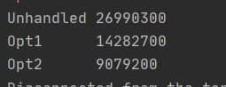

# Array Optimization

### Task code

``` java
public static void unhandledFun(){

        int[] Vector = new int[2];
        int res = 0;

        for (int j = 500000000; j > 0; j--)
        {
            Vector [0]++;
            Vector [0]++;
        }

        Vector[1] = Vector[0];

        for (int j = 0; j < 10000000; j++)
        {
            Vector [0]--;
            Vector [0]--;
        }

        Vector[1] = Vector[0];

    }
```

### Optimization #1 
The meaning of the first optimization is to replace two accessing to the increment and decrement variable of Array
Instead of it , we`ll use one access point which will increase and decrease `Vector[0]` by 2 .

``` java
    public static void optimized1(){
        int[] Vector = new int[2];
        int res = 0;

        for (int j = 500000000; j > 0; j--)
        {
            Vector [0]+= 2;
        }

        Vector[1] = Vector[0];

        for (int j = 0; j < 10000000; j++)
        {
            Vector [0]-=2;
        }

        Vector[1] = Vector[0];

    }
```

### Optimization #2 
The sense of the second optimization is to calculate total increase sum or total decrease sum in separate primitive value with type `int` and replace the value of `Vector[0]` after for loop
``` java
 public static void optimized2(){
        int[] Vector = new int[2];
        int res = 0;
        for (int j = 500000000; j > 0; j--)
        {
            res += 2;
        }
        Vector[0] = res;

        Vector[1] = Vector[0];

        for (int j = 0; j < 10000000; j++)
        {
            res -= 2;
        }
        Vector [0]-=res;
        Vector[1] = Vector[0];

    }
```
### RESULT 
 
